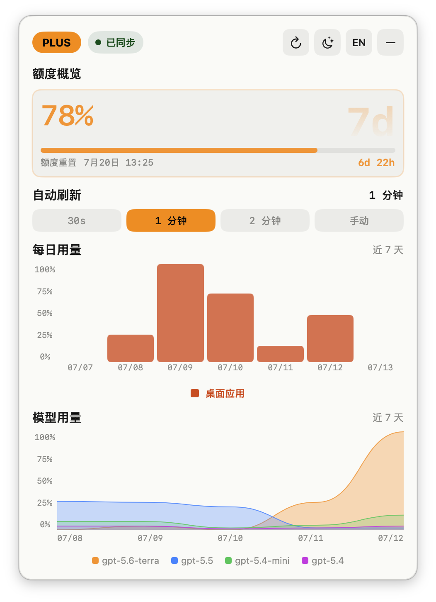
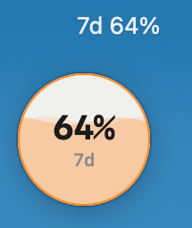
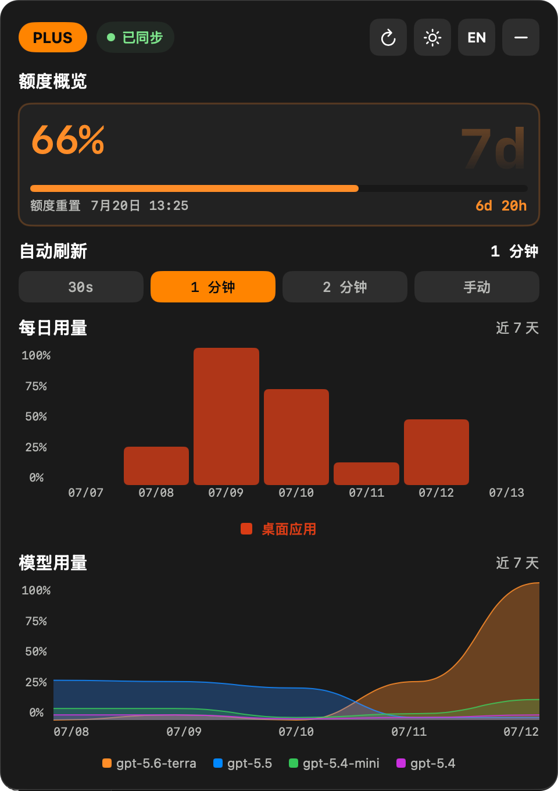

<p align="center">
  
</p>

<h1 align="center">Codex Quota Menu Bar</h1>

<p align="center">在 macOS 菜单栏中快速查看 Codex 实时额度、重置时间与最近用量。</p>

<p align="center">
  <a href="https://github.com/jiangzenong/codex-quota-menubar/releases/latest"></a>
  
  
  <a href="README_en.md">English</a>
</p>

<p align="center">
  
</p>

## 界面预览

### 菜单栏与悬浮球

<p align="center">
  
</p>

### 浅色与深色主题

<table>
  <tr>
    <td align="center"><strong>浅色主题</strong></td>
    <td align="center"><strong>深色主题</strong></td>
  </tr>
  <tr>
    <td></td>
    <td></td>
  </tr>
</table>

## 功能亮点

- 按服务实际返回结果显示额度窗口，不假定一定同时存在 5 小时和 7 天窗口。
- 在详情面板中查看套餐、剩余额度、重置时间、每日用量与模型使用趋势。
- 支持 30 秒、1 分钟、2 分钟和手动刷新。
- 详情面板与悬浮球可独立显示；面板按普通窗口层级运行，悬浮球可拖动并在移入时直接关闭。
- 左键菜单栏额度即可展开额度 Popover；右键可打开完整操作菜单。
- 可选开机启动，不需要再次输入 Codex 账号密码。

## 下载

从 [Releases](https://github.com/jiangzenong/codex-quota-menubar/releases/latest) 下载最新版本。推荐使用 DMG，打开后将应用拖入“应用程序”文件夹。

- Apple 芯片：`CodexQuotaMenuBar-macos-apple-silicon.dmg`
- Intel 芯片：`CodexQuotaMenuBar-macos-intel.dmg`
- Release 同时提供 ZIP 备用包。

当前发布包使用 ad-hoc 签名，尚未使用 Apple Developer ID 公证。首次打开时，macOS 可能要求在“系统设置 → 隐私与安全性”中确认。

## 使用要求

- macOS 15 或更高版本。
- 已通过 Codex Desktop 或 Codex CLI 登录。
- 可以访问 `chatgpt.com`。

## 使用方法

启动应用后，它会读取本机现有的 Codex 登录状态并请求额度数据。菜单栏会展示服务当前返回的窗口，例如 `5h 72% · 7d 54%`；如果只有一个窗口，则只显示该窗口。

- 应用启动后默认显示悬浮球；关闭后，本次运行期间不会因自动刷新再次显示。
- 左键菜单栏额度：展开紧凑的额度 Popover，可查看额度与重置时间或进入完整详情；点击外部区域、切换应用或按 Esc 会自动关闭。
- 右键菜单栏额度：立即刷新、显示或隐藏面板、切换悬浮球、打开 Codex 用量页、设置开机启动或退出。
- 面板右上角：刷新、切换主题、切换语言、独立显示或隐藏悬浮球，或关闭详情面板。
- 悬浮球：左键可打开或关闭详情面板，右键可立即刷新、显示或隐藏详情面板、隐藏悬浮球；鼠标移入后可通过红色关闭按钮单独隐藏。

## 隐私与安全

应用从 `~/.codex/auth.json`（或 `CODEX_HOME/auth.json`）读取已有访问令牌，并仅向 `https://chatgpt.com/backend-api/wham/...` 下的 Codex 额度与用量端点发送请求。应用不会保存访问令牌、聊天内容或原始接口响应，也没有额外遥测。

请注意：本项目是非官方开源工具，与 OpenAI 没有隶属或背书关系。它依赖 Codex 当前使用的 Web 接口，接口变化可能导致功能暂时不可用。

## 本地构建

需要 Swift 6 和 Xcode Command Line Tools：

```bash
swift test
./Scripts/build-app.sh
open dist/CodexQuotaMenuBar.app
```

构建产物位于 `dist/CodexQuotaMenuBar.app`。脚本会生成应用图标、写入 bundle 信息并执行 ad-hoc 签名；未设置 `APP_VERSION` 时，会自动使用最新 `v*` Git 标签的版本号。

## 常见问题

### 菜单栏没有显示额度

确认已登录 Codex Desktop 或 Codex CLI，然后右键菜单栏额度并选择“立即刷新”。如果仍无数据，请重新登录 Codex 后重试。

### macOS 阻止打开应用

确认安装包来自本仓库的 [Releases](https://github.com/jiangzenong/codex-quota-menubar/releases/latest)，然后在 Finder 中按住 Control 点击应用并选择“打开”，或前往“系统设置 → 隐私与安全性”选择“仍要打开”。

### 应用提示“已损坏，无法打开”

先重新下载对应架构的 Release。如果确认文件来自本仓库，但隔离属性仍阻止启动，可执行：

```bash
xattr -dr com.apple.quarantine /Applications/CodexQuotaMenuBar.app
```

不要对来源不明的应用绕过 macOS 安全检查。

### 构建时找不到 Swift

安装 Xcode Command Line Tools 后重试：

```bash
xcode-select --install
```

## 项目状态

项目仍处于早期阶段。功能反馈与可复现的错误报告欢迎通过 [Issues](https://github.com/jiangzenong/codex-quota-menubar/issues) 提交。
